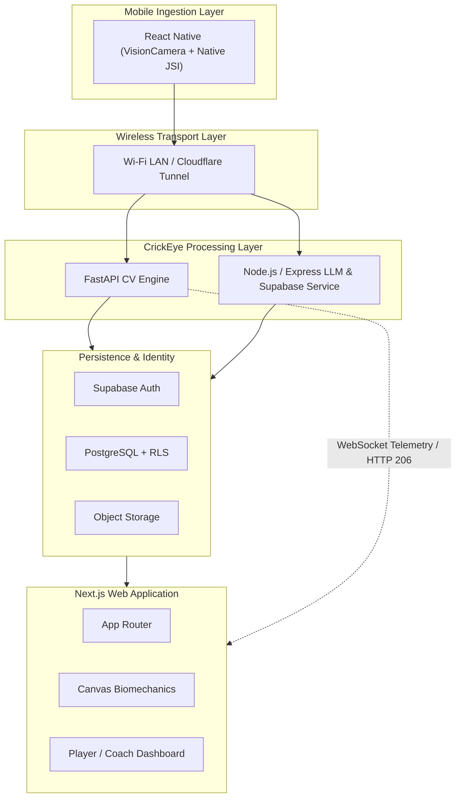
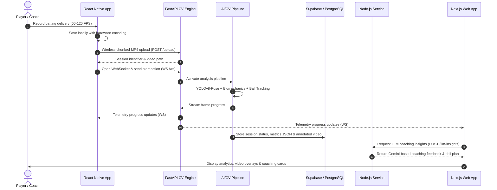
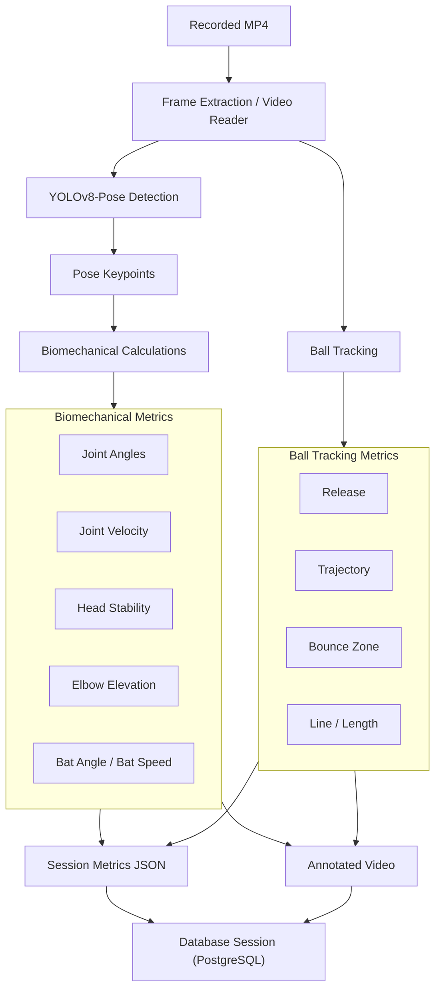
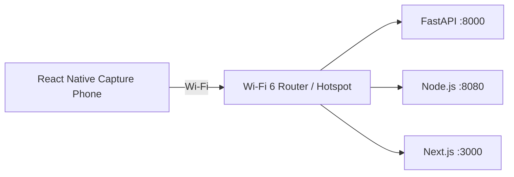
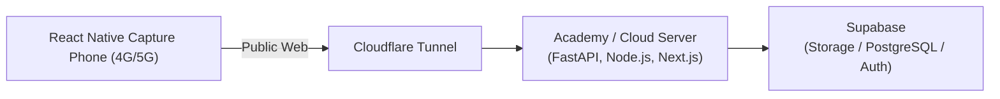

# CrickEye — Technical Architecture & Specification

## Mobile & Next.js System Architecture and Technical Specification
*AI-Powered Cricket Biomechanics and Delivery Tracking Platform*

| Property | Specification |
| :--- | :--- |
| **Document Version** | 1.0 |
| **Target Platforms** | React Native (iOS / Android), Next.js Web |
| **Primary Capture** | 60–120 FPS mobile video capture |
| **Communication** | Wi-Fi LAN / Cloudflare Tunnel |
| **Core AI** | FastAPI + PyTorch + YOLOv8: Pose + Ball Tracking |
| **Identity & Storage** | Supabase Auth + PostgreSQL + Object Storage |

---

## 1. Executive Summary

CrickEye is an automated biomechanical analysis and delivery-tracking platform designed for cricket batting nets and coaching academies. The platform uses high-frame-rate mobile video capture and computer vision to analyze batting technique and ball movement. The source specification identifies pose estimation, joint velocity, bat angle, and ball trajectory as key analytical outputs.

The system utilizes a unified cross-platform mobile capture approach using a **React Native application** powered by VisionCamera and native C++ JSI modules. A **Next.js web application** provides the primary analytics and coaching review interface.

A central FastAPI computer-vision engine processes uploaded video, while a Node.js/Express service provides LLM-based coaching insights and Supabase administration. Supabase supplies authentication, PostgreSQL persistence, Row-Level Security, and object storage.

---

## 2. Architecture Principles and Constraints

### 2.1 Core Principles
- **Native-first mobile camera access** for high-performance capture via VisionCamera JSI.
- **Wireless-only communication** during field operation.
- **Centralized AI processing** rather than duplicating heavy inference on clients.
- **Shared backend services** for React Native mobile capture and Next.js web presentation.
- **Role-based Player/Coach access** with PostgreSQL Row-Level Security.
- **Real-time processing telemetry** through WebSockets.
- **Range-based video playback** through HTTP 206 Partial Content.

### 2.2 Explicit Constraints
- No Capacitor, Cordova, or PhoneGap wrappers.
- No USB tethering or USB-dependent production communication.
- Wireless transport through Wi-Fi LAN and Cloudflare Tunnel.
- Stable 60 FPS minimum capture; 120 FPS preferred where supported.

---

## 3. System Architecture

The platform is organized into five major layers: mobile ingestion, wireless transport, backend/AI services, persistence/identity, and web presentation.



### 3.1 Component Responsibilities

| Component | Technology | Primary Responsibility |
| :--- | :--- | :--- |
| **React Native** | VisionCamera, native modules, C++ JSI | Cross-platform camera capture (60–120 FPS), background upload, WebSocket telemetry, analytics review. |
| **FastAPI** | Python | Video ingestion, HTTP 206 streaming, WebSocket orchestration, CV/AI analysis. |
| **Node.js** | Express | LLM coach insight generation and Supabase service administration. |
| **Supabase** | Auth, PostgreSQL, Storage | Identity, relational persistence, RLS, raw/annotated video and JSON storage. |
| **Next.js** | React 18, TypeScript, App Router | Analytics dashboard, session review, biomechanics visualization, coach portal. |

---

## 4. Mobile Ingestion Specification

### React Native Application
*Target audience:* Cross-platform players and coaches who want high-performance capture and analytics review in one application.

- **Direct Hardware Access:** `react-native-vision-camera` with native C++ JSI frame processing, avoiding any WebView DOM layer.
- **High Frame-Rate Recording:** Target capture of 1080p at 60 FPS, or 720p at 120 FPS on supported hardware with hardware audio/video multiplexing.
- **Exposure Control:** Manual exposure locking to reduce lighting flicker from floodlights or changing sunlight.
- **Non-blocking Uploads:** Background file streaming through native filesystem bridges over Wi-Fi LAN or remote HTTPS.
- **Real-time Telemetry:** Native WebSocket connectivity for real-time pipeline telemetry and progress monitoring.
- **Secure Persistence:** Supabase JavaScript SDK backed by hardware-encrypted secure storage (Android Keystore / iOS Keychain).

---

## 5. Physical Cricket Net Setup

The physical capture setup directly affects pose, bat-angle, joint-velocity, and ball-trajectory measurements.

| Parameter | Recommended Specification | Reason |
| :--- | :--- | :--- |
| **Camera Angle** | Side-on (90°) or 45° front-offside | Provides visibility of stance, backlift, elbow elevation, and follow-through. |
| **Distance from Batsman** | 4.0–6.0 m | Keeps full body and bat-swing arc inside the frame. |
| **Tripod Height** | 1.2–1.5 m (chest height) | Reduces perspective distortion in vertical joint-angle calculations. |
| **Frame Rate** | 60 FPS minimum; 120 FPS preferred | Reduces motion blur during fast bat swings and ball release. |
| **Exposure** | Locked manual; fast shutter (1/500s+) | Reduces pose-keypoint jitter caused by motion blur. |

---

## 6. Wireless Communication Architecture

CrickEye is designed for wireless operation. During field use, the capture device communicates with the processing server over a local Wi-Fi network or through a Cloudflare Tunnel for remote access.

### 6.1 Local LAN
- Capture phone and processing server connect to the same Wi-Fi 6 router or mobile hotspot.
- Communication uses private IP addressing such as `192.168.x.x`.
- Targets ultra-low local signaling latency and high LAN transfer throughput.

### 6.2 Remote / Outdoor Operation
- The processing server may run at an academy clubhouse or cloud instance.
- Cloudflare Tunnel exposes the required services without conventional port forwarding.
- Mobile devices can use 4G/5G to upload video and receive WebSocket analysis progress.

### 6.3 Communication Protocols

| Purpose | Protocol | Endpoint / Behavior |
| :--- | :--- | :--- |
| **Video Ingestion** | HTTP/1.1 or HTTP/2 multipart upload | `POST /upload`; chunked MP4 upload. |
| **Telemetry** | WebSocket | `/ws`; progress, frame, processing FPS, and recovery messages. |
| **Video Playback** | HTTP 206 Partial Content | `/uploads/{path}`; frame-accurate seeking without full download. |
| **AI Coach Insights** | REST JSON | `/llm-insights`; sends structured biomechanics/session metrics to LLM service. |

---

## 7. End-to-End Session Workflow



1. Player records a batting delivery at 60–120 FPS using the React Native app.
2. React Native application saves the recording locally using hardware encoding.
3. MP4 is uploaded wirelessly to the FastAPI ingestion endpoint.
4. FastAPI creates/returns a session identifier and video path.
5. Mobile opens a WebSocket and sends the analysis-start action.
6. FastAPI activates the analysis pipeline.
7. YOLOv8-Pose, biomechanics processing, and ball tracking analyze frames.
8. Progress is streamed to the mobile application and Next.js dashboard.
9. Annotated video and metrics JSON are generated.
10. Session status and results are stored in PostgreSQL.
11. Next.js requests LLM insights from the Node.js service.
12. Gemini-based coaching feedback is returned and displayed with the analytics.

---

## 8. AI and Computer Vision Pipeline

### 8.1 Pipeline Architecture



### 8.2 Analysis Outputs
- **Pose keypoints** for shoulders, elbows, wrists, hips, knees, and ankles.
- **Joint-angle and movement measurements**.
- **Bat angle and bat-speed related metrics**.
- **Head stability and elbow elevation indicators**.
- **Ball release, trajectory, and bounce-zone information**.
- **Shot/event classifications** where supported by the implemented analysis pipeline.

---

## 9. Next.js Web Application

The Next.js web application is the primary analytics, management, and review hub for players, coaches, and academy administrators.

### 9.1 Routes

| Route | Purpose |
| :--- | :--- |
| `/auth/login` | Secure login. |
| `/auth/signup` | Account creation with Player/Coach role selection. |
| `/dashboard` | Role-adaptive landing dashboard. |
| `/dashboard/sessions/[id]` | Interactive session analyzer. |

### 9.2 Player Dashboard
- Recent session scores.
- Personal-best bat speed.
- Consistency trends.
- Shot-distribution radar visualization.

### 9.3 Coach Dashboard
- Academy roster overview.
- Multi-player session queue.
- Flagged technical errors such as collapsed elbow or early head fall.

### 9.4 Interactive Session Analyzer
- Synchronized video player with frame-by-frame scrubbing.
- HTML5 Canvas 2D biomechanical skeleton overlay.
- Ball trajectory visualizer with pitch map, bounce zone, line, and length indicators.
- Gemini-powered AI Coach Insights and personalized drills.

---

## 10. Biomechanical Visualization Engine

- Synchronizes the Canvas overlay with the HTML5 video timecode.
- Maps joint keypoints to normalized `(x, y)` coordinates.
- Renders shoulders, elbows, wrists, hips, knees, and ankles.
- Uses technique-compliance color coding:

| Indicator | Meaning |
| :--- | :--- |
| <span style="color:green">**Green**</span> | **Biomechanically optimal**; e.g., high elbow on drive or stable head at impact. |
| <span style="color:orange">**Amber**</span> / <span style="color:red">**Red**</span> | **Technical defect**; e.g., reaching, loss of balance, or closed bat face. |

---

## 11. Authentication, Authorization, and Data Governance

### 11.1 Authentication
- Supabase Auth with JWT.
- TLS/HTTPS for token transmission.
- React Native client stores refresh tokens in hardware-encrypted secure storage (Keystore / Keychain).

### 11.2 Row-Level Security (RLS)

| Table | Operation | Player | Coach |
| :--- | :--- | :--- | :--- |
| `profiles` | `SELECT` | Own profile only | All player profiles + own profile |
| `profiles` | `UPDATE` | Own profile only | Coach-specific settings |
| `sessions` | `SELECT` | Own sessions only | All assigned player sessions |
| `sessions` | `INSERT` | Own sessions only | Allowed on behalf of player |
| `sessions` | `UPDATE` | Own sessions only | Coach remarks / flags allowed |
| `sessions` | `DELETE` | Own sessions only | Restricted to owner / admin |

---

## 12. Storage Model

- **Raw MP4 recordings** are stored in object storage.
- **Annotated output videos** are stored alongside source recordings.
- **Structured metrics and analysis results** are stored as JSON data, including JSONB session results where specified.
- **PostgreSQL** stores profiles, sessions, and access-controlled application data.

---

## 13. API and Service Contract

The service-level interfaces define the communication contract between the React Native client, Next.js web application, and backend services.

| Service | Endpoint | Method / Protocol | Purpose |
| :--- | :--- | :--- | :--- |
| **FastAPI** | `/upload` | `POST` | Receive chunked MP4 upload. |
| **FastAPI** | `/ws` | `WebSocket` | Start and monitor analysis. |
| **FastAPI** | `/uploads/{path}` | `GET` (HTTP 206) | HTTP range-based video playback. |
| **Node.js** | `/llm-insights` | `POST` | Generate coaching feedback from session metrics. |

### 13.1 Example WebSocket Messages

#### Start
```json
{
  "action": "start",
  "video_path": "<path>"
}
```

#### Progress
```json
{
  "type": "progress",
  "progress": 45,
  "frame": 120
}
```

#### Complete
```json
{
  "type": "complete",
  "results": { ... }
}
```

---

## 14. Recommended Repository Structure

```
CrickEye/
├── mobile/           # React Native client (VisionCamera + JSI)
├── web/              # Next.js Application
├── backend/
│   ├── fastapi/      # CV ingestion and orchestration
│   └── node/         # LLM insights / Supabase service
├── ai/               # Pose, biomechanics, ball analytics
├── database/         # SQL, migrations, policies
├── docs/             # Architecture and project documentation
├── tests/
├── docker/
├── .env.example
├── docker-compose.yml
└── README.md
```

---

## 15. Deployment Topology

### 15.1 Local Practice Nets


### 15.2 Remote / Outdoor Grounds


---

## 16. Engineering Roadmap

| Phase | Planned Work | Source Schedule |
| :--- | :--- | :--- |
| **Phase 1** | Wireless endpoint hardening: Cloudflare Tunnel and LAN discovery | 2026-09-01 to 2026-09-12 |
| **Phase 2** | React Native VisionCamera; native C++ frame processing; offline/reconnect logic | 2026-09-13 to 2026-10-05 |
| **Phase 3** | Next.js App Router; Supabase RLS/Auth; Canvas player; Coach dashboard; Gemini card | 2026-10-06 to 2026-10-27 |
| **Phase 4** | Cricket net field testing; production deployment and multi-user benchmarking | 2026-10-28 to 2026-11-10 |

---

## 17. Technology Decision Matrix

| Layer | Selected Technology | Alternative Rejected | Rationale |
| :--- | :--- | :--- | :--- |
| **Mobile Capture** | React Native (VisionCamera + C++ JSI) | Capacitor / Cordova / PhoneGap | Direct native camera access, cross-platform iOS/Android support, and high-frame-rate capture without WebView overhead. |
| **Data Transport** | Wi-Fi LAN + Cloudflare Tunnel | USB / ADB tethering | Wireless operation and flexible tripod placement in cricket nets. |
| **Web Presentation** | Next.js App Router + TypeScript | Traditional SPA | Integrated web application and session dashboard architecture. |
| **AI Inference** | FastAPI + PyTorch | In-browser WASM | Heavy computer-vision workloads are centralized on the processing server. |
| **Database & Auth** | Supabase (PostgreSQL + RLS) | Firebase / custom MongoDB | Relational model and strict Player/Coach access control. |

---

## 18. Operational Requirements

- Camera must remain stable on a tripod during capture.
- Exposure should be locked where supported.
- Fast shutter settings should be used for high-speed batting footage.
- The capture device should have sufficient local storage for offline buffering.
- The Wi-Fi network should be tested before a practice session.
- The processing server must have the required Python, PyTorch, and model runtime environment.
- Remote operation requires a functioning Cloudflare Tunnel configuration.

---

## 19. Risks and Mitigations

| Risk | Impact | Mitigation |
| :--- | :--- | :--- |
| **Motion blur** | Pose and ball-tracking errors | Use 60–120 FPS and fast shutter / locked exposure. |
| **Wi-Fi fluctuation** | Upload interruption | Local buffering and background retry handling. |
| **Long high-resolution recording** | Thermal/battery pressure | Hardware codec and controlled capture settings. |
| **Poor camera placement** | Incorrect biomechanics | Follow the 4–6 m, 1.2–1.5 m tripod and angle guidelines. |
| **Remote connectivity failure** | No live telemetry | Use LAN mode when possible and provide reconnect/retry handling. |
| **Unauthorized data access** | Privacy/security exposure | JWT authentication and PostgreSQL RLS. |

---

## 20. Acceptance Criteria

- A supported mobile device running the React Native app can capture cricket footage at the target frame rate where hardware permits.
- Video can be uploaded without USB tethering.
- The system can create a processing session and report its status.
- The FastAPI pipeline can process supported video and produce analysis output.
- Progress can be delivered over WebSocket.
- The Next.js application can play the source/annotated video and display biomechanics overlays.
- Player and Coach access follows the defined RLS rules.
- LLM coaching insights can be requested from structured session metrics.
- The system works over a local Wi-Fi network and can support remote operation through the configured tunnel.

---

## 21. Conclusion

CrickEye is specified as a wireless, multi-client cricket biomechanics platform. Its architecture separates high-performance mobile capture from centralized computer-vision processing and web-based analytics. React Native provides the cross-platform mobile capture layer, Next.js provides the analytics and coaching interface, FastAPI hosts the computer-vision pipeline, Node.js provides LLM coach insights, and Supabase provides identity, relational persistence, storage, and row-level access control.

The architecture intentionally excludes Capacitor/Cordova-style wrappers and USB-dependent production communication. This preserves direct native camera access and supports practical camera placement in cricket nets.

---

## 22. Source Basis and Documentation Note

This document is a formalized and reorganized version of the supplied CrickEye Mobile & Next.js System Architecture & Specification. It preserves the supplied technologies, constraints, interfaces, physical setup guidance, security model, deployment scenarios, roadmap, and technology rationale while focusing mobile capture purely on the cross-platform React Native stack.
