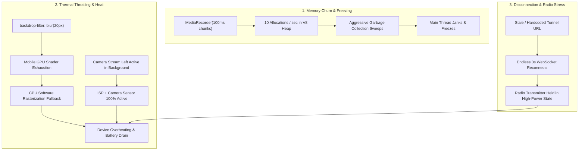

# CrickEye Pro — Mobile Optimization & Deployment Guide

| Document Information | Details |
| :--- | :--- |
| **Document Version** | 2.1 — Corrected & Explained |
| **Last Updated** | September 2026 |
| **Architecture** | Mobile Capture Client + Remote AI Processing |
| **AI Processing** | FastAPI • PyTorch • YOLO Pose • YOLO Ball • Physics |
| **Target Platforms** | Android APK / WebView • iOS Safari / PWA |
| **Purpose** | Mobile stability, thermal efficiency, connectivity and deployment |

---

## 1. Executive Summary

CrickEye Pro uses a mobile phone as the camera and user-interface client while computationally expensive AI processing runs on a PC or cloud server. Mobile testing revealed three major issues: recording-related UI freezes, excessive battery/thermal load, and loss of backend connectivity.

This revised document explains not only what was changed, but why each change is useful, what limitation it has, and how to verify that the optimization actually works on a real device.

| Problem | Why It Happens | Corrective Direction |
| :--- | :--- | :--- |
| **UI freezing** | Very frequent MediaRecorder events can increase allocation and GC pressure; heavy UI work can add jank. | Use a larger recorder timeslice (1000 ms) and keep the main thread lightweight. |
| **Heat / battery drain** | Camera, encoding, and GPU rendering are power-intensive; background activity wastes resources. | Stop camera on backgrounding and reduce expensive mobile effects (`backdrop-filter: none`). |
| **DISCONNECTED / retrying** | A stale endpoint or uncontrolled reconnect loop prevents stable communication. | Use a configurable endpoint and exponential reconnect backoff. |

---

## 2. Root Cause Analysis — With Explanation



### 2.1 MediaRecorder Chunk Churn
A `MediaRecorder` timeslice controls how often the browser/WebView emits recorded data. With a 100 ms timeslice, the application can receive approximately 10 data events per second. Each event can create `Blob` objects and trigger JavaScript bookkeeping. On constrained mobile WebViews, this can increase garbage collection and main-thread pressure.

> [!IMPORTANT]
> **Clarification**: Increasing the timeslice does **not** reduce the amount of video being recorded. It reduces how frequently the JavaScript application has to process recorder output.

```javascript
// Previous: High GC pressure (10 events/sec)
mediaRecorder.start(100);

// Optimized: 1 event/sec, smooth main thread
mediaRecorder.start(1000);
```

### 2.2 H.264 / MP4 Codec Selection
The application queries the runtime to detect which recording MIME types it supports. H.264/MP4 is prioritized where the browser/WebView reports support. However, documentation must not assume that H.264 MediaRecorder encoding is always hardware-accelerated on every Android or iOS device—hardware support is implementation-dependent.

```javascript
function getSupportedMimeType() {
  const candidates = [
    "video/mp4;codecs=avc1.42E01E,mp4a.40.2",
    "video/mp4;codecs=h264",
    "video/mp4",
    "video/webm;codecs=vp8",
    "video/webm;codecs=vp9",
    "video/webm"
  ];
  return candidates.find(type =>
    typeof MediaRecorder !== 'undefined' &&
    MediaRecorder.isTypeSupported &&
    MediaRecorder.isTypeSupported(type)
  ) || "";
}
```

**Explanation**: Runtime detection is safer than hardcoding one codec. If MP4/H.264 is unavailable, the application falls back to another supported format (WebM) and ensures that the backend can decode it.

### 2.3 Expensive CSS Rendering
`backdrop-filter: blur(...)` can require intensive compositing passes. Multiple translucent and blurred layers increase GPU workload, especially during a live camera preview. Disabling these effects on mobile reduces rendering complexity. The `transform` / `will-change` optimization should be used selectively; applying it to every element can create unnecessary compositor layers and increase memory usage.

### 2.4 Camera Lifecycle Leakage
Camera capture should not continue unnecessarily when the application is hidden. On Android, WebView lifecycle callbacks pause the WebView and explicitly request camera teardown. In the web layer, the `visibilitychange` event provides an additional safety mechanism.

```javascript
document.addEventListener("visibilitychange", () => {
  if (document.hidden) {
    stopWebcamStream();
  }
});
```

### 2.5 WebSocket Reconnection Stress
A fixed 3-second retry interval can repeatedly wake the networking stack when the server is unavailable. Exponential backoff increases the delay after repeated failures and reduces unnecessary network activity:
- Retry 1: ~3s
- Retry 2: ~6s
- Retry 3: ~12s
- Retry 4+: cap at ~15s

The implementation resets the retry delay counter immediately upon a successful connection.

---

## 3. Implemented Optimizations

### 3.1 Android `MainActivity.java`
- **Hardware Acceleration**: Enable hardware-accelerated WebView rendering through the Android window/WebView configuration.
- **`onPause()`**: Request camera teardown, pause WebView execution, and pause timers.
- **`onResume()`**: Resume WebView execution and timers.
- **`onDestroy()`**: Clear the WebView and release resources.

```java
@Override
protected void onPause() {
    super.onPause();
    if (mWebView != null) {
        mWebView.evaluateJavascript(
            "if (typeof stopWebcamStream === 'function') stopWebcamStream();",
            null
        );
        mWebView.onPause();
        mWebView.pauseTimers();
    }
}

@Override
protected void onResume() {
    super.onResume();
    if (mWebView != null) {
        mWebView.onResume();
        mWebView.resumeTimers();
    }
}

@Override
protected void onDestroy() {
    if (mWebView != null) {
        mWebView.loadUrl("about:blank");
        mWebView.stopLoading();
        mWebView.setWebChromeClient(null);
        mWebView.setWebViewClient(null);
        mWebView.destroy();
        mWebView = null;
    }
    super.onDestroy();
}
```

**Explanation**: `onPause()` reduces resource use while the Activity is not in the foreground. `onDestroy()` provides final cleanup. Camera cleanup must also exist in the JavaScript layer because Android lifecycle callbacks alone do not replace correct `MediaStream` handling.

### 3.2 Frontend Camera and Recording Pipeline
- Use a **1000 ms MediaRecorder timeslice** instead of 100 ms.
- Stop every `MediaStreamTrack` when recording/preview is no longer required.
- Clear `video.srcObject` after stopping the stream.
- Handle `document.visibilitychange` events.
- Use runtime MIME-type detection with backend-compatible fallback.
- Use exponential WebSocket reconnect backoff.
- For large files (>4MB), avoid loading the entire recording into memory solely for fingerprinting by reading header and trailer slices.

```javascript
function stopWebcamStream() {
  if (webcamStream) {
    webcamStream.getTracks().forEach(track => {
      try { track.stop(); } catch(e) {}
      try { track.enabled = false; } catch(e) {}
    });
    webcamStream = null;
  }
  if (videoElement) {
    try {
      videoElement.pause();
      videoElement.srcObject = null;
    } catch(e) {}
  }
}
```

### 3.3 Mobile CSS
```css
@media (max-width: 768px) {
  .mobile-nav-bar,
  .top-header,
  .ce-modal-overlay,
  .ce-modal-dialog,
  .start-header,
  .auth-gate-card {
    backdrop-filter: none !important;
    -webkit-backdrop-filter: none !important;
  }

  .video-wrapper,
  .webcam-viewport-wrap,
  #webcamLivePreview,
  #mainVideo,
  canvas {
    transform: translateZ(0);
    will-change: transform;
  }
}
```

**Explanation**: Blur removal targets the most expensive visual effects. The compositor hints are applied selectively to active media surfaces.

---

## 4. Operational Architecture

| Layer | Components | Role |
| :--- | :--- | :--- |
| **Mobile** | Android APK / Chrome WebView / iOS Safari or PWA; camera | Capture delivery, provide controls, upload media, show results |
| **Transport** | HTTPS/WSS; Cloudflare Tunnel for development or stable production gateway | Secure communication between client and backend |
| **AI Backend** | FastAPI; PyTorch; YOLO Pose; YOLO Ball; physics modules | Inference, tracking, trajectory, pitch and biomechanics calculations |

### 4.1 Data Flow
1. User opens CrickEye Pro on the mobile device.
2. The mobile camera provides a video stream to the application.
3. The application records a delivery using a supported browser `MediaRecorder` configuration.
4. The resulting media is uploaded to the FastAPI backend.
5. The backend runs pose estimation, ball detection/tracking, and physics analysis.
6. Analysis results and telemetry are returned to the mobile application.
7. The application renders the delivery report and analytics.

> [!NOTE]
> **Crucial Concept**: The phone does not need to execute the YOLO/PyTorch models. Keeping inference on the server reduces mobile computational workload and allows a stronger model to be used independently of the phone's hardware.

---

## 5. Deployment Guide

### 5.1 Solution A — Local Network / Development
1. Start the AI backend on the PC.
2. Start the Node.js service if the project requires it.
3. Expose the development server through the configured Cloudflare Tunnel when the phone cannot directly access the PC.
4. Open CrickEye Pro on the phone.
5. Open **Server Settings** and enter the current server URL.
6. Select **Save & Connect** and verify **CONNECTED (READY)**.
7. Record a delivery and confirm upload and analysis.

- **FastAPI local address**: `http://127.0.0.1:8000`
- **Node API address**: `http://127.0.0.1:8080`
- **Development tunnel**: `https://<current-session>.trycloudflare.com`

> [!WARNING]
> **Important Scoping Rule**: `127.0.0.1` on the phone refers to the phone itself, **not** the development PC. Therefore, a phone cannot reach a PC service using the PC's `127.0.0.1` address. Use the PC's LAN IP when on the same Wi-Fi network, or use a configured public tunnel (Cloudflare).

### 5.2 Solution B — Cloud Deployment
For a standalone consumer application, deploy the FastAPI service to cloud infrastructure that can handle the model workload. A GPU is recommended when the chosen models require substantial inference throughput.

#### 5.2.1 Dockerfile
```dockerfile
FROM python:3.11-slim

RUN apt-get update && apt-get install -y --no-install-recommends \
    libgl1-mesa-glx libglib2.0-0 ffmpeg \
    && rm -rf /var/lib/apt/lists/*

WORKDIR /app
COPY requirements.txt .
RUN pip install --no-cache-dir -r requirements.txt

COPY . .

EXPOSE 8000
CMD ["uvicorn", "backend.main:app", "--host", "0.0.0.0", "--port", "8000"]
```

> [!CAUTION]
> **Deployment note**: This image is a generic CPU-based Python container. If the backend requires CUDA/PyTorch GPU inference, the production image and host must be configured for a compatible NVIDIA/CUDA stack. A plain slim Python image does not automatically provide GPU acceleration.

#### 5.2.2 Production Endpoint
```javascript
function getApiBaseUrl() {
  const saved = localStorage.getItem('crickeye_server_url');
  if (saved && saved.trim()) {
    return saved.trim().replace(/\/+$/, '');
  }
  return 'https://api.crickeye.com';
}
```
*Note: The `api.crickeye.com` domain is an example placeholder unless configured. Replace it with the actual production API hostname.*

#### 5.2.3 APK Build
1. Verify that the production API endpoint and application configuration are correct.
2. Build the Android project using the project's build script or Gradle configuration:
   ```cmd
   .\build_apk.bat
   ```
3. Install the APK on a test device (`CrickEye-Pro.apk`).
4. Test permissions, recording, upload, analysis, backgrounding, and reconnection.
5. Only distribute the APK after the verification checklist passes.

---

## 6. Verification & Acceptance Criteria

| Test | Procedure | Expected Result | If It Fails |
| :--- | :--- | :--- | :--- |
| **Unit tests** | `python tests/test_ball_analytics.py` | 21 tests pass, 0 errors | Inspect failed test and backend analytics code. |
| **Type check** | `pyrefly check tests/test_ball_analytics.py` | 0 errors | Fix reported type errors before release. |
| **APK build** | `.\build_apk.bat` | `BUILD SUCCESSFUL` -> `CrickEye-Pro.apk` | Inspect Gradle/Android build logs. |
| **Camera teardown** | Background app during camera preview | Camera indicator/LED stops promptly | Check `visibilitychange`, `onPause`, and `MediaStream` track cleanup. |
| **Memory stability** | Record repeated 8-second deliveries | No continuous memory growth or severe UI jank | Profile Blob handling, upload queue, and rendering. |
| **Thermal stability** | Run 5 consecutive recordings | No abnormal sustained heating | Check resolution/FPS, camera lifecycle, and GPU effects. |
| **Reconnect** | Stop backend temporarily | Retry interval increases and eventually caps | Check WebSocket retry counter and timer cleanup. |
| **Production endpoint** | Launch without saved endpoint | Configured production endpoint is selected | Check environment/configuration values. |

### 6.1 Important Measurement Correction
The statement *"Memory stays constant (~2 MB chunk total)"* should **not** be treated as a universal acceptance criterion. A video recording contains substantially more data than 2 MB in many camera configurations. The meaningful test is that application memory does **not continuously grow** because old chunks, object URLs, event handlers, or streams are being retained. Measure memory with Android Studio or Chrome DevTools and compare before and after repeated recordings.

---

## 7. Common Errors and Explanations

| Error / Symptom | Explanation | Recommended Fix |
| :--- | :--- | :--- |
| **`DISCONNECTED — retrying`** | Client cannot establish or maintain the configured WebSocket/backend connection. | Check URL, server availability, HTTPS/WSS, firewall, and retry logic. |
| **Camera remains active after minimizing** | MediaStream tracks were not stopped or lifecycle/visibility cleanup did not run. | Call `stopWebcamStream()` and verify Android `onPause()`. |
| **MP4 is not recorded** | The current WebView/browser does not support the requested MIME type. | Use `MediaRecorder.isTypeSupported()` and a compatible fallback. |
| **Phone becomes hot during preview** | Camera capture and rendering are inherently power-intensive; heavy CSS can add load. | Lower resolution/FPS when possible, disable mobile blur, and stop camera when hidden. |
| **UI freezes during recording** | High-frequency recorder events, large JS operations, or rendering can block the main thread. | Use a longer timeslice (1000ms), avoid synchronous file processing, and profile main-thread work. |
| **Analysis upload hangs** | Large media, unstable network, server timeout, or upload queue issues. | Check request size/timeouts, server logs, and client upload state. |
| **127.0.0.1 does not connect from phone** | `127.0.0.1` points to the device making the request (the phone). | Use the PC's LAN address or a Cloudflare/ngrok tunnel. |
| **GPU deployment fails** | A CPU-only container does not automatically provide CUDA GPU support. | Use a CUDA-compatible image, host, and PyTorch build when GPU inference is required. |

---

## 8. Recommended Production Hardening

- **Use HTTPS and WSS** for production traffic.
- **Add authentication and authorization** to the API.
- **Validate upload size, MIME type, and file duration** on the server.
- **Add request timeouts** and clear upload failure states.
- **Use server-side rate limiting** to protect the inference service.
- **Log connection, upload, and inference latency** without storing unnecessary personal data.
- **Use a stable production domain** rather than a temporary development tunnel URL.
- **Monitor CPU/GPU utilization, memory, inference latency, and concurrent requests**.
- **Test across multiple Android devices and iOS versions** before release.
- **Keep the client and backend codec/decode support synchronized**.

---

## 9. Final Deployment Checklist

1. Backend starts successfully and passes unit/type checks.
2. Production API is reachable over HTTPS/WSS.
3. Mobile application requests and receives camera permission correctly.
4. Recording works using a runtime-supported MIME type.
5. Camera stops when recording ends and when the app becomes hidden.
6. No continuous memory growth occurs after repeated recordings.
7. WebSocket retries back off and do not run indefinitely at a high frequency.
8. Five consecutive deliveries can be recorded and analyzed without severe thermal or UI problems.
9. APK installs and launches successfully on target Android devices.
10. Authentication, upload validation, and production monitoring are enabled before public release.

---

## Conclusion

CrickEye Pro should be treated as a distributed mobile AI system rather than an AI model running entirely on the phone. The mobile client is optimized for camera capture, responsive UI, and efficient communication; the server handles YOLO/PyTorch inference and analytics.

The key engineering corrections established in Version 2.1:
1. **Codec Support vs. Guaranteed Hardware Encoding**: While H.264/MP4 is preferred, hardware acceleration is device-dependent; resilient runtime detection and fallbacks are essential.
2. **Network Scoping (`127.0.0.1`)**: On a phone, `127.0.0.1` refers to localhost on the phone itself, requiring LAN IP or tunnel routing to connect to the PC server.
3. **Realistic Memory Acceptance Metric**: Replaced the unrealistic 2 MB fixed memory criterion with a leak-free memory profile over successive recordings.
4. **CUDA/GPU Containerization**: Generic Python containers run on CPU; CUDA-enabled images and host drivers are required for hardware-accelerated GPU inference in production.
