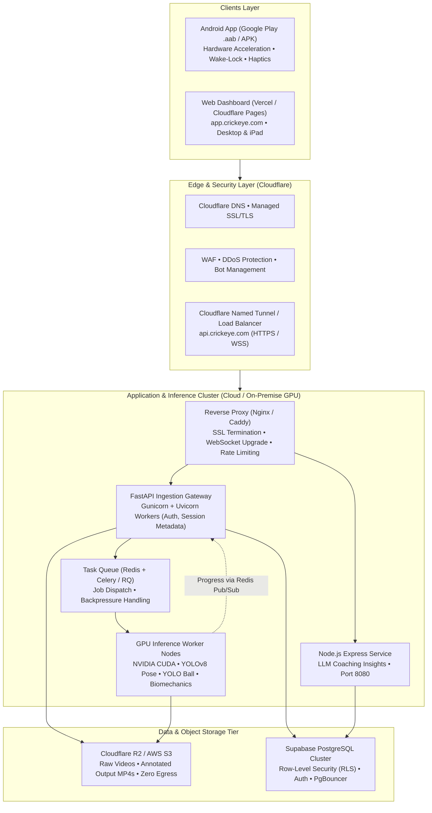
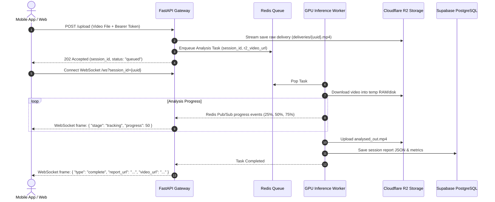

# CrickEye Pro — Production Deployment Guide & Master Checklist

| Metadata | Details |
| :--- | :--- |
| **Document Version** | 1.0.0 — Production Release Standard |
| **Last Updated** | September 2026 |
| **Target Architecture** | Distributed AI Inference (GPU) • Edge Cloudflare Gateway • Supabase Cloud • Native Mobile / Web Clients |
| **Classification** | Operations & DevOps Guide |
| **Status** | Active Implementation Standard |

---

## 1. Executive Summary & Production Topology

In development and proof-of-concept stages, CrickEye Pro runs locally on `localhost:8000` (FastAPI) and `localhost:8080` (Node.js), utilizing ephemeral Cloudflare quick tunnels (`*.trycloudflare.com`) and synchronous single-threaded AI inference (`ThreadPoolExecutor(max_workers=1)`).

Moving to a **high-availability production environment** transforms CrickEye Pro into a scalable, secure, and distributed architecture:



---

## 2. Infrastructure Sizing & Compute Requirements

### 2.1 Hardware Requirements Comparison

| Component | Minimum (Low Traffic / Staging) | Recommended Production (Scale) |
| :--- | :--- | :--- |
| **AI Inference Node** | 1x NVIDIA T4 GPU (16 GB VRAM), 4 vCPUs, 16 GB RAM (e.g. AWS `g4dn.xlarge`, RunPod) | 1–2x NVIDIA L4 or A10G (24 GB VRAM), 8 vCPUs, 32 GB RAM (AWS `g5.2xlarge`) |
| **Inference Throughput** | ~15-20 FPS (2.5–3.5s per 5-sec delivery) | ~60-90 FPS (0.7–1.2s per 5-sec delivery) |
| **Redis & Web Gateway** | 2 vCPU, 4 GB RAM | 4 vCPU, 8 GB RAM (managed Redis cluster) |
| **Object Storage** | Local Disk (Ephemeral - Dev only) | Cloudflare R2 or AWS S3 Standard with Lifecycle policies |
| **PostgreSQL Database** | Supabase Free Tier | Supabase Pro (Micro/Small Compute with PgBouncer connection pool) |

### 2.2 Storage & Bandwidth Budgeting
* **5-Second 1080p Delivery Video:** ~8 MB – 15 MB (H.264 @ 60 FPS).
* **Annotated Output Video:** ~10 MB – 18 MB.
* **Telemetry Data (JSON):** ~45 KB per delivery.
* **Storage Recommendation:** Utilize **Cloudflare R2** for storing raw deliveries and analyzed video files to eliminate cloud egress costs.

---

## 3. Step-by-Step Production Deployment Roadmap

### Step 1: CUDA / GPU Containerization

The development Dockerfile uses generic CPU packages. Production requires the NVIDIA Container Toolkit and CUDA-optimized base layers.

#### Production GPU Dockerfile (`Dockerfile.gpu`):
```dockerfile
FROM nvidia/cuda:12.1.1-runtime-ubuntu22.04

ENV DEBIAN_FRONTEND=noninteractive \
    PYTHONUNBUFFERED=1 \
    PYTORCH_CUDA_ALLOC_CONF="expandable_segments:True,garbage_collection_threshold:0.8"

# Install system libraries and FFmpeg
RUN apt-get update && apt-get install -y --no-install-recommends \
    python3.11 \
    python3-pip \
    python3.11-dev \
    libgl1-mesa-glx \
    libglib2.0-0 \
    ffmpeg \
    curl \
    && rm -rf /var/lib/apt/lists/*

WORKDIR /app

# Upgrade pip and install PyTorch with CUDA 12.1 wheels
RUN python3.11 -m pip install --no-cache-dir --upgrade pip && \
    python3.11 -m pip install --no-cache-dir \
    torch torchvision --index-url https://download.pytorch.org/whl/cu121

# Install requirements
COPY requirements.txt .
RUN python3.11 -m pip install --no-cache-dir -r requirements.txt

# Copy source code and models
COPY . .

EXPOSE 8000
CMD ["uvicorn", "backend.main:app", "--host", "0.0.0.0", "--port", "8000", "--workers", "2"]
```

---

### Step 2: Asynchronous Task Queue Architecture

In production, running inference inside FastAPI via `ThreadPoolExecutor(max_workers=1)` creates server bottlenecks. As concurrent practice nets upload deliveries, requests must be queued.



---

### Step 3: Database & State Hardening (Supabase)

1. **Deploy Production Schema:**
   - Run `backend/supabase_schema.sql` on the production Supabase database.
2. **Enable Row Level Security (RLS):**
   - Ensure all tables (`sessions`, `profiles`, `telemetry`, `drills`) have RLS enabled:
   ```sql
   ALTER TABLE sessions ENABLE ROW LEVEL SECURITY;

   CREATE POLICY "Users can only view their own sessions"
   ON sessions FOR SELECT
   USING (auth.uid() = user_id);

   CREATE POLICY "Users can only insert their own sessions"
   ON sessions FOR INSERT
   WITH CHECK (auth.uid() = user_id);
   ```
3. **Connection Pooling:**
   - Configure your backend connection string to point to Supabase **Transaction Mode Pooler** (Port `6543`) to prevent exhaustion of PostgreSQL connection slots.

---

### Step 4: Persistent Domain, Cloudflare & SSL/TLS Setup

Do **not** use temporary `trycloudflare.com` tunnels in production.

#### Production Option A: Dedicated Cloud Host (AWS / GCP / RunPod)
1. Point your domain DNS:
   - `api.crickeye.com` -> Cloudflare Proxied A-Record (Elastic IP).
   - `app.crickeye.com` -> Vercel / Cloudflare Pages.
2. In Cloudflare Dashboard:
   - **SSL/TLS Encryption Mode:** Set to **Full (Strict)**.
   - **WebSockets:** Ensure WebSockets toggle is **Enabled**.
   - **Maximum Upload Size:** Set to 100 MB.

#### Production Option B: Cloudflare Named Tunnel (Self-Hosted GPU Hardware)
If you operate dedicated local/edge GPU hardware (e.g. Net Practice facility server):
1. Authenticate Cloudflare daemon:
   ```bash
   cloudflared tunnel login
   ```
2. Create persistent tunnel:
   ```bash
   cloudflared tunnel create crickeye-prod
   ```
3. Configure `~/.cloudflared/config.yml`:
   ```yaml
   tunnel: <TUNNEL_UUID>
   credentials-file: /etc/cloudflared/<TUNNEL_UUID>.json

   ingress:
     - hostname: api.crickeye.com
       service: http://localhost:8000
     - hostname: node.crickeye.com
       service: http://localhost:8080
     - service: http_status:404
   ```
4. Install and run as a system service:
   ```bash
   cloudflared service install
   systemctl start cloudflared  # or net start cloudflared on Windows
   ```

---

### Step 5: Web Application Deployment (`app.crickeye.com`)

1. **Build Production Web Application:**
   Deploy the Next.js / Web front-end to **Vercel** or **Cloudflare Pages**.
2. **Configure Production Environment Variables:**
   ```env
   NEXT_PUBLIC_FASTAPI_URL=https://api.crickeye.com
   NEXT_PUBLIC_FASTAPI_WS=wss://api.crickeye.com/ws
   NEXT_PUBLIC_NODE_API_URL=https://node.crickeye.com
   NEXT_PUBLIC_SUPABASE_URL=https://your-production-project.supabase.co
   NEXT_PUBLIC_SUPABASE_ANON_KEY=eyJhbGciOiJIUzI1NiIsInR5cCI6IkpXVCJ9...
   ```
3. **Enforce HTTPS for Camera Devices:**
   Web browsers strictly forbid `navigator.mediaDevices.getUserMedia` unless served over valid HTTPS or `localhost`. Production deployment must have zero mixed-content warnings.

---

### Step 6: Android App Production Release (`.aab` / `.apk`)

The mobile client (`android/` and `mobile/`) must be compiled for release with signing credentials and code obfuscation.

#### 1. Generate Production Release Keystore
```bash
keytool -genkey -v -keystore crickeye-release.jks -keyalg RSA -keysize 2048 -validity 10000 -alias crickeyekey
```

#### 2. Update `android/app/build.gradle` for Release
```groovy
android {
    ...
    defaultConfig {
        applicationId "com.crickeye.pro"
        minSdk 24
        targetSdk 34
        versionCode 2
        versionName "1.1.0"
    }

    signingConfigs {
        release {
            storeFile file(System.getenv("KEYSTORE_PATH") ?: "crickeye-release.jks")
            storePassword System.getenv("KEYSTORE_PASSWORD")
            keyAlias System.getenv("KEY_ALIAS") ?: "crickeyekey"
            keyPassword System.getenv("KEY_PASSWORD")
        }
    }

    buildTypes {
        release {
            signingConfig signingConfigs.release
            minifyEnabled true
            shrinkResources true
            proguardFiles getDefaultProguardFile('proguard-android-optimize.txt'), 'proguard-rules.pro'
        }
    }
}
```

#### 3. Update Android ProGuard Rules (`android/app/proguard-rules.pro`)
```proguard
# Preserve WebView JavaScript Interfaces
-keepclassmembers class * {
    @android.webkit.JavascriptInterface <methods>;
}

# Keep models and data classes
-keep class com.crickeye.pro.** { *; }
```

#### 4. Compile Production App Bundle (.aab)
```bash
cd android
./gradlew bundleRelease
```
Upload the resulting `app-release.aab` to Google Play Console Internal / Production Track.

---

## 4. Production Hardening & Security Standards

### 4.1 FastAPI Backend Security (`backend/main.py`)
1. **Restrict CORS:**
   ```python
   ALLOWED_ORIGINS = [
       "https://app.crickeye.com",
       "https://crickeye.com",
       "http://localhost:3000",  # for internal dev only
   ]
   app.add_middleware(
       CORSMiddleware,
       allow_origins=ALLOWED_ORIGINS,
       allow_credentials=True,
       allow_methods=["GET", "POST", "OPTIONS"],
       allow_headers=["Authorization", "Content-Type", "Range"],
       expose_headers=["Content-Range", "Accept-Ranges", "Content-Length"],
   )
   ```

2. **Supabase JWT Authentication Guard:**
   Protect `/upload` and `/ws` with token verification:
   ```python
   from fastapi import Depends, HTTPException, status
   from fastapi.security import HTTPBearer, HTTPAuthorizationCredentials
   import jwt

   security = HTTPBearer()

   def verify_token(credentials: HTTPAuthorizationCredentials = Depends(security)):
       token = credentials.credentials
       try:
           payload = jwt.decode(
               token, 
               os.environ["SUPABASE_JWT_SECRET"], 
               algorithms=["HS256"], 
               audience="authenticated"
           )
           return payload
       except Exception:
           raise HTTPException(
               status_code=status.HTTP_401_UNAUTHORIZED,
               detail="Invalid or expired authentication token"
           )
   ```

3. **Input Validation & Upload Limits:**
   - Validate MIME types (`video/mp4`, `video/webm`, `video/quicktime`).
   - Disallow files larger than 100 MB.
   - Enforce video duration checks using `ffprobe` (reject uploads > 30 seconds).

---

## 5. Master Production Readiness Checklist

### Category A: Code & Architecture
- [ ] All development debug flags removed (`DEBUG=0`, `reload=False`).
- [ ] Synchronous `_executor` replaced with distributed task queue (Redis + Celery/RQ).
- [ ] Videos migrated from local ephemeral `uploads/` directory to S3/R2 Object Storage.
- [ ] Pipeline cache versioning (`pipeline_cache_version.py`) synced with client.
- [ ] Unit tests pass cleanly: `python tests/test_ball_analytics.py` (21 tests passing).
- [ ] Type check passes cleanly: `pyrefly check tests/test_ball_analytics.py`.

### Category B: Infrastructure & GPU
- [ ] GPU host provisioned with NVIDIA drivers (CUDA 12.1+).
- [ ] GPU Docker container built and verified (`Dockerfile.gpu`).
- [ ] PyTorch detects GPU hardware (`torch.cuda.is_available() == True`).
- [ ] PyTorch memory allocator configured (`expandable_segments:True,garbage_collection_threshold:0.8`).
- [ ] Auto-restart policies enabled (`restart: always` or systemd service).
- [ ] Automated cleanup cron job running for temporary local scratch files older than 24 hours.

### Category C: Network, Domain & SSL
- [ ] Permanent production domain configured (`api.crickeye.com`, `app.crickeye.com`).
- [ ] Ephemeral `trycloudflare.com` tunnel disabled.
- [ ] Cloudflare SSL set to Full (Strict) with zero SSL warnings.
- [ ] WebSockets protocol (`WSS://`) verified and responsive.
- [ ] CORS policies restricted strictly to production web and mobile domains.
- [ ] Cloudflare upload body limit increased to accommodate video payloads (100 MB).

### Category D: Database & Security
- [ ] Dedicated Supabase production project created.
- [ ] Full database schema executed (`backend/supabase_schema.sql`).
- [ ] Row Level Security (RLS) active and tested across all tables.
- [ ] Supabase connection pooling enabled (Port 6543 / PgBouncer).
- [ ] `SUPABASE_SERVICE_ROLE_KEY` stored exclusively in server environment; never shipped in client code.
- [ ] JWT authentication enforced on `/upload` and `/ws` endpoints.

### Category E: Mobile Client (Android & React Native)
- [ ] Production keystore generated and securely backed up.
- [ ] `android/app/build.gradle` configured with release signing config.
- [ ] ProGuard / R8 code shrinking and obfuscation enabled (`minifyEnabled true`).
- [ ] `usesCleartextTraffic="false"` set in AndroidManifest.xml.
- [ ] Camera permissions, wake-lock, and haptic countdown verified on physical device.
- [ ] Reconnection logic verified with exponential backoff.
- [ ] App bundle (`.aab`) built and tested in Google Play Console internal test track.

### Category F: Observability & Monitoring
- [ ] Sentry error tracking configured for FastAPI, Node.js, and Mobile/Web clients.
- [ ] Health check endpoints actively monitored (`/api/public-config`, `/health`).
- [ ] Server telemetry monitoring CPU, RAM, and GPU VRAM utilization (e.g. Grafana/Prometheus).
- [ ] Automated uptime alerting enabled (alerts sent to Slack/Email on downtime).

---

## 6. Quick Verification Smoke Test Script

Run this verification script on your production server or deployment machine to confirm end-to-end operational readiness:

```bash
#!/bin/bash
set -e

echo "=== CrickEye Pro Production Smoke Test ==="

# 1. Check API Health
echo "[1/4] Checking API Health..."
curl -s -f https://api.crickeye.com/api/public-config > /dev/null
echo "✓ API Gateway is Healthy"

# 2. Check Node Service
echo "[2/4] Checking Node Coaching Service..."
curl -s -f https://node.crickeye.com/health > /dev/null || echo "! Node health returned non-200"
echo "✓ Node API is reachable"

# 3. Check GPU Availability
echo "[3/4] Checking CUDA Acceleration..."
python -c "import torch; assert torch.cuda.is_available(), 'CUDA not available!'; print(f'✓ GPU Detected: {torch.cuda.get_device_name(0)}')"

# 4. Check WebSocket Handshake
echo "[4/4] Checking WebSocket Endpoint..."
python -c "
import asyncio, websockets, json
async def test_ws():
    async with websockets.connect('wss://api.crickeye.com/ws') as ws:
        await ws.send(json.dumps({'action': 'ping'}))
        res = await ws.recv()
        data = json.loads(res)
        assert data.get('type') == 'pong'
        print('✓ WebSocket Ping/Pong Successful')
asyncio.run(test_ws())
"

echo "=== All Core Production Systems Operational! ==="
```
