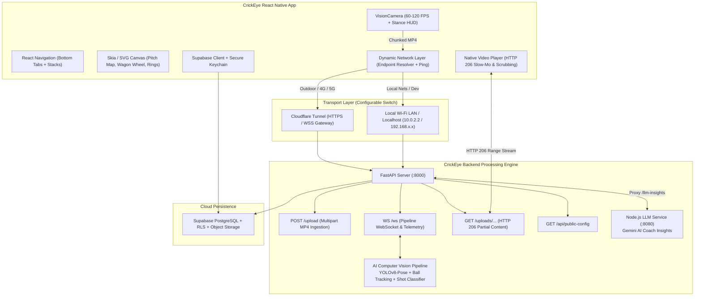
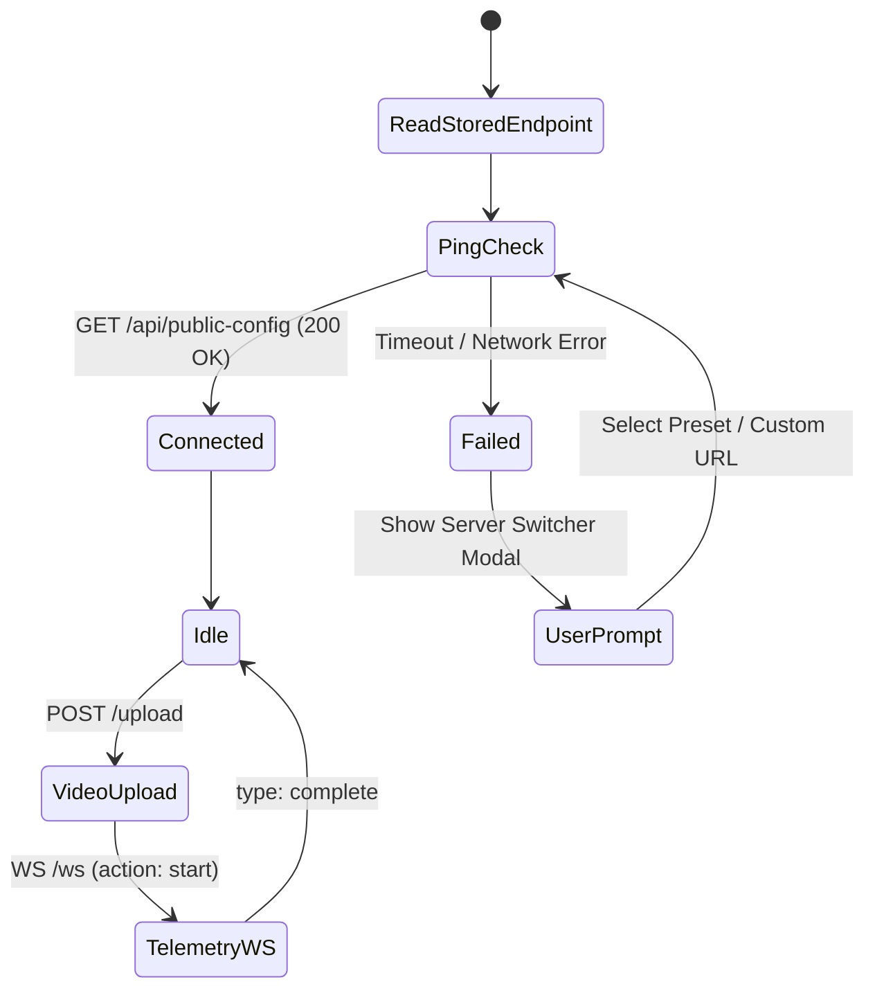

# CrickEye Pro — React Native Application Specification & Architecture

| Document Metadata | Specification |
| :--- | :--- |
| **Document Title** | CrickEye Pro: Pure React Native System Specification |
| **Document Version** | 1.0 — Production Blueprint |
| **Target Platforms** | React Native (iOS & Android) — Native Hardware Access |
| **Backend Integration** | Dual-Transport: Cloudflare Tunnel & Localhost / LAN |
| **Core AI Services** | FastAPI (CV Ingestion & Processing), Node.js (Gemini LLM Insights) |
| **Database & Identity**| Supabase (Auth, PostgreSQL RLS, Storage) |
| **Feature Target** | 100% Parity with CrickEye Pro Web v6.5 |

---

## 1. Executive Summary

This document specifies the complete technical blueprint for creating a **pure React Native mobile application** for CrickEye Pro. The new application replaces the legacy Android WebView container with a high-performance, native-first architecture while preserving **100% of the features** present in the current web application ([App.js](file:///c:/Users/HP/OneDrive/Desktop/CRIE/App.js), [index.html](file:///c:/Users/HP/OneDrive/Desktop/CRIE/index.html), and [components/](file:///c:/Users/HP/OneDrive/Desktop/CRIE/components)).

### Key Objectives:
1. **Dynamic Dual-Transport Networking**: Seamlessly switch between remote **Cloudflare Tunnel** (`https://*.trycloudflare.com` / custom tunnel) and local development / net practice environments (**Localhost**, Android Emulator `10.0.2.2:8000`, or Wi-Fi LAN `192.168.x.x:8000`).
2. **High-Speed Camera Ingestion**: Direct camera sensor control using `react-native-vision-camera` (60–120 FPS high-frame-rate, manual exposure lock, and popping crease/stance alignment HUD).
3. **Real-Time Bidirectional Telemetry**: Resilient WebSocket (`/ws`) connection for pipeline execution, frame-by-frame progress streaming, and instant result delivery.
4. **Interactive Hardware-Accelerated Visualizations**: High-performance Pitch Map, 360° Wagon Wheel, and circular metric rings rendered via `@shopify/react-native-skia` or `react-native-svg`.
5. **Slow-Motion Video Playback**: Range-aware HTTP 206 video playback with variable speed rates (0.25×, 0.5×, 1×, 2×), looping, and synchronized biomechanical HUD data.

---

## 2. System Architecture & Communication Topology



---

## 3. Network Architecture: Cloudflare & Localhost

### 3.1 Dynamic Endpoint Configuration
The application maintains an active backend URL in local persistent storage (`AsyncStorage`).

| Environment | Base URL Pattern | WebSocket Protocol | Typical Use Case |
| :--- | :--- | :--- | :--- |
| **Cloudflare Live Demo** | `https://*.trycloudflare.com` | `wss://` | Remote cricket nets, mobile data (4G/5G), remote evaluator testing. |
| **Localhost (Desktop/Web)** | `http://localhost:8000` | `ws://` | React Native for Web or local simulator testing. |
| **Android Emulator** | `http://10.0.2.2:8000` | `ws://` | Android Studio emulator loopback to host PC. |
| **Wi-Fi LAN (Cricket Nets)**| `http://192.168.x.x:8000` | `ws://` | Low-latency net practice where phone and PC share a local Wi-Fi router or hotspot. |

### 3.2 Network Layer State Machine



### 3.3 Cloudflare Tunnel Constraints & Solutions
1. **Idle Timeout Mitigation**: Cloudflare Tunnels close idle WebSockets after 100 seconds. The React Native `TelemetrySocketClient` transmits a `{ "action": "ping" }` heartbeat every 25 seconds.
2. **Payload Size Optimization**: High-frame-rate videos (60–120 FPS) can reach 20–50 MB. Video upload uses standard multipart/form-data streaming via native filesystem paths without loading the entire binary into JavaScript V8 heap memory.
3. **Automatic Fallback**: If the Cloudflare tunnel endpoint fails (e.g., tunnel process restarted), the network client automatically displays an alert offering a one-tap fallback to the local LAN IP.

---

## 4. Complete Feature Parity Matrix

Every feature existing in the current [App.js](file:///c:/Users/HP/OneDrive/Desktop/CRIE/App.js), [index.html](file:///c:/Users/HP/OneDrive/Desktop/CRIE/index.html), and [components/](file:///c:/Users/HP/OneDrive/Desktop/CRIE/components/) is mapped below to its React Native architecture:

| # | Current Web Feature | Web Location | React Native Architecture & Components |
| :- | :--- | :--- | :--- |
| **1** | **Server Connection Switcher** | `#serverSettingsModal` | `ServerSettingsModal.tsx` with AsyncStorage, Ping Test button, and preset chips (`Cloudflare`, `Localhost`, `Emulator`, `LAN`). |
| **2** | **Supabase Authentication** | `#authGate`, `supabase.auth` | `AuthScreen.tsx` using `@supabase/supabase-js`, with JWT refresh tokens persisted in native keychain. |
| **3** | **Role Separation (Player vs Coach)**| `#playerAppShell` vs `#coachDashboard` | Dynamic React Navigation root: Players navigate to `PlayerTabs`; Coaches navigate to `CoachDashboardScreen`. |
| **4** | **High-Speed Live Camera** | Web `navigator.mediaDevices` | `CameraCaptureScreen.tsx` using `react-native-vision-camera` (v4), locked exposure, 60–120 FPS. |
| **5** | **Camera Facing Toggle** | Front/Rear radio buttons | Instant switch between `useCameraDevice('back')` (tripod) and `useCameraDevice('front')` (selfie). |
| **6** | **3-2-1 Audio/Visual Countdown** | Web Audio oscillator + DOM overlay | Animated full-screen countdown overlay + `react-native-sound` beeps + `react-native-haptic-feedback` vibration. |
| **7** | **Stance Alignment Guide** | `#overlayGuide` (Head circle + Crease line) | Absolute positioned `<View>` overlay with dashed borders and non-blocking touch events. |
| **8** | **Auto-Stop Recording** | 5s JS timer | Native `cameraRef.current.stopRecording()` triggered automatically after 5,000 ms. |
| **9** | **Gallery Video Upload** | File `<input type="file">` | `launchImageLibrary` from `react-native-image-picker` with MP4 video filtering. |
| **10**| **Multipart Upload with Progress** | XHR to `POST /upload` | `uploadService.ts` utilizing native `XMLHttpRequest` with upload percentage callback (`0-100%`). |
| **11**| **Real-time Pipeline Telemetry** | `WS /ws` | `telemetrySocket.ts` parsing `{ type: "progress", progress, frame, fps }` and updating on-screen HUD. |
| **12**| **Synchronized Video Player** | `<video>` with Range requests | `react-native-video` streaming from `/uploads/{path}` with HTTP 206 support. |
| **13**| **Video Speed & Loop Controls** | `#btnSpeed` (1x, 0.5x, 0.25x), `#btnLoop` | Native player props: `rate={playbackRate}` and `repeat={isLooping}`. |
| **14**| **Frame-by-Frame Scrubbing** | `#timelineTrack`, `#timelineProgress` | Interactive gesture-based scrub bar with timecode and current frame index display. |
| **15**| **Session Score & Rating** | [components/PlayCard.js](file:///c:/Users/HP/OneDrive/Desktop/CRIE/components/PlayCard.js) | `PlayCardView.tsx` with animated star rating (★ 1–5), verdict badge ("Top class", "Good", etc.), and score. |
| **16**| **Circular Metric Rings** | SVG circle stroke-dasharray | `@shopify/react-native-skia` animated circular rings for Timing, Middling, Impact, and Backlift. |
| **17**| **Interactive Hawkeye Pitch Map** | [components/PitchMap.js](file:///c:/Users/HP/OneDrive/Desktop/CRIE/components/PitchMap.js) | `PitchMapSkia.tsx` rendering 2D pitch length zones (Yorker, Full, Good, Short, Bouncer) and bounce markers. |
| **18**| **360° Wagon Wheel** | [components/wagonWheel.js](file:///c:/Users/HP/OneDrive/Desktop/CRIE/components/wagonWheel.js) | `WagonWheelSkia.tsx` rendering radial cricket field, color-coded shot vectors, and boundary circles. |
| **19**| **Wagon Wheel Coverage Bars** | Off-side, Leg-side, Straight bars | Progress bars displaying shot count and percentage distribution. |
| **20**| **Ball Analytics Metrics** | [components/ballAnalytics.js](file:///c:/Users/HP/OneDrive/Desktop/CRIE/components/ballAnalytics.js) | Speeds (Release & Bounce in km/h), delivery table, and length classification cards. |
| **21**| **Biomechanics Feed & Badges** | `#biomech-feed` | Cards displaying bat speed (km/h), elbow elevation, joint angles, and compliance badges (Green/Amber/Red). |
| **22**| **Gemini AI Coaching Insights** | `POST /llm-insights` | Markdown-rendered AI coaching card highlighting technical strengths, flaws, and recommended training drills. |
| **23**| **My Sessions List** | `#sessionsList` | Native `FlatList` displaying session cards, scores, timestamps, and thumbnail previews. |
| **24**| **Session-to-Session Comparison** | `#sessionCompareModal` | Side-by-side delta comparison modal comparing Session A vs Session B metrics or monthly trends. |
| **25**| **Coach Control Dashboard** | `#coachDashboard` | Roster list of registered players, aggregated statistics, and individual player session inspection. |

---

## 5. API & Service Communication Contracts

### 5.1 Video Upload (`POST /upload`)
* **Request:** Multipart form upload containing the video file recorded by `react-native-vision-camera`.
  ```http
  POST /upload HTTP/1.1
  Host: <backend-host>
  Content-Type: multipart/form-data; boundary=----WebKitFormBoundary...

  ------WebKitFormBoundary...
  Content-Disposition: form-data; name="file"; filename="delivery_1726330000.mp4"
  Content-Type: video/mp4

  [binary data]
  ```
* **Response (200 OK):**
  ```json
  {
    "session_id": "9b1deb4d-3b7d-4bad-9bdd-2b0d7b3dcb6d",
    "video_path": "uploads/9b1deb4d-3b7d-4bad-9bdd-2b0d7b3dcb6d/video.mp4"
  }
  ```

### 5.2 Real-time WebSocket Protocol (`WS /ws`)
* **Handshake (Client ➔ Server):**
  ```json
  {
    "action": "start",
    "video_path": "uploads/9b1deb4d-3b7d-4bad-9bdd-2b0d7b3dcb6d/video.mp4"
  }
  ```
* **Heartbeat Keep-Alive (Client ➔ Server every 25s):**
  ```json
  { "action": "ping" }
  ```
* **Processing Telemetry (Server ➔ Client):**
  ```json
  {
    "type": "progress",
    "progress": 55,
    "frame": 165,
    "fps": 31.2
  }
  ```
* **Completion Event (Server ➔ Client):**
  ```json
  {
    "type": "complete",
    "results": {
      "session_id": "9b1deb4d-3b7d-4bad-9bdd-2b0d7b3dcb6d",
      "overall_score": 86,
      "rating": "Top class",
      "shots": [
        {
          "shot_type": "cover",
          "shot_name": "Cover Drive",
          "bat_speed_kmh": 94.5,
          "elbow_elevation_deg": 142.0,
          "timing_score": 88
        }
      ],
      "ball_analytics": {
        "release_speed_kmh": 128.4,
        "bounce_speed_kmh": 109.1,
        "pitch_x": 0.42,
        "pitch_y": 0.68,
        "length": "Good Length",
        "line": "Off Stump"
      }
    }
  }
  ```

### 5.3 Partial-Content Video Streaming (`GET /uploads/{path}`)
* **Header:** `Range: bytes=0-1048575`
* **Response:** `HTTP 206 Partial Content` with `Content-Range: bytes 0-1048575/15728640` and `Accept-Ranges: bytes`. Ensures smooth frame scrubbing and slow-motion playback in `react-native-video`.

### 5.4 AI Coaching Feedback (`POST /llm-insights`)
* **Request (Client ➔ Server):**
  ```json
  {
    "session_id": "9b1deb4d-3b7d-4bad-9bdd-2b0d7b3dcb6d",
    "metrics": { ... }
  }
  ```
* **Response:**
  ```json
  {
    "ok": true,
    "llm_insights": {
      "summary": "Excellent high elbow elevation on off-drive deliveries.",
      "technical_flaws": ["Minor head fall towards off-stump on full deliveries."],
      "recommended_drills": ["Stationary cone drive drills focusing on head balance."]
    }
  }
  ```

---

## 6. React Native Application Structure

```
mobile/
├── android/                   # Native Android configuration & Gradle build
├── ios/                       # Native iOS project & Podfile
├── src/
│   ├── api/
│   │   ├── client.ts          # Axios / Fetch client with dynamic base URL
│   │   ├── uploadService.ts   # Multipart video uploader with % progress
│   │   ├── telemetrySocket.ts # WebSocket client with keep-alive & reconnect
│   │   └── supabase.ts        # Supabase client with native Keychain storage
│   ├── components/
│   │   ├── camera/
│   │   │   ├── CameraView.tsx      # VisionCamera hardware wrapper
│   │   │   ├── StanceGuide.tsx     # Crease & Head alignment overlay
│   │   │   └── CountdownTimer.tsx  # 3-2-1 visual/audio/haptic countdown
│   │   ├── canvas/
│   │   │   ├── PitchMapSkia.tsx    # 2D pitch length zones & bounce markers
│   │   │   ├── WagonWheelSkia.tsx  # 360° interactive wagon wheel
│   │   │   └── MetricRingSkia.tsx  # Animated circular score rings
│   │   ├── player/
│   │   │   ├── PlayCard.tsx        # Session summary card & rating stars
│   │   │   ├── BiomechCards.tsx    # Joint angle & bat speed metric cards
│   │   │   └── BallPaceStrip.tsx   # Speed & delivery table view
│   │   ├── video/
│   │   │   └── VideoScrubber.tsx   # Native player with slow-mo & frame HUD
│   │   └── common/
│   │       ├── ServerModal.tsx     # Cloudflare vs Localhost connection picker
│   │       └── StatusBadge.tsx     # Online / Tracking status pill
│   ├── navigation/
│   │   ├── RootNavigator.tsx       # Root auth switcher
│   │   ├── PlayerTabNavigator.tsx  # Capture, Score, Pitch, Biomech, Sessions
│   │   └── AuthNavigator.tsx       # Login & Signup screens
│   ├── screens/
│   │   ├── auth/
│   │   │   ├── LoginScreen.tsx
│   │   │   └── SignupScreen.tsx
│   │   ├── capture/
│   │   │   └── CaptureScreen.tsx
│   │   ├── score/
│   │   │   └── ScoreScreen.tsx
│   │   ├── pitch/
│   │   │   └── PitchScreen.tsx
│   │   ├── biomech/
│   │   │   └── BiomechScreen.tsx
│   │   ├── sessions/
│   │   │   ├── SessionsScreen.tsx
│   │   │   └── CompareModal.tsx
│   │   └── coach/
│   │       └── CoachScreen.tsx
│   ├── hooks/
│   │   ├── useServerUrl.ts    # React hook for active server URL
│   │   ├── useTelemetry.ts    # React hook for pipeline progress
│   │   └── useHaptics.ts      # Tactile feedback hook
│   └── types/
│       └── session.ts         # Full TypeScript types for pipeline metrics
├── package.json
└── App.tsx
```

---

## 7. Performance & Thermal Management

### 7.1 Sensor Lifecycle Management
Leaving the camera sensor active while reviewing analytics drains battery and causes device overheating in outdoor cricket nets.
* **Rule**: When the user switches from the **Capture** tab to the **Score**, **Pitch**, or **Sessions** tabs, `isActive={false}` is set on the VisionCamera component to immediately shut down the physical camera sensor and ISP (Image Signal Processor).

### 7.2 Memory-Safe Video Streaming
* Recordings are stored directly to the device's temporary cache (`react-native-fs.CachesDirectoryPath`).
* The upload service streams directly from file descriptors rather than buffering file contents in JavaScript memory, avoiding Out-Of-Memory (OOM) crashes on 120 FPS high-bitrate clips.

### 7.3 GPU Canvas Acceleration
* Pitch maps and Wagon wheels are rendered using Skia's direct GPU canvas (`@shopify/react-native-skia`). This offloads 2D drawing computations from the JavaScript thread, maintaining a steady 60 FPS UI refresh rate.

---

## 8. Verification & Acceptance Criteria

| Stage | Verification Test | Success Metric |
| :--- | :--- | :--- |
| **1. Connectivity** | Select `Cloudflare Live Demo` preset and press "Test Ping". | Status reports `Connected (200 OK)` with measured latency in ms. |
| **2. Local Fallback**| Select `Localhost` or `10.0.2.2:8000` and press "Test Ping". | Connects locally without tunnel dependency. |
| **3. High-FPS Recording** | Capture a 5-second delivery using the rear camera on a tripod. | Records at 60 or 120 FPS without dropped frames; auto-stops at 5s. |
| **4. Upload & Telemetry** | Trigger delivery upload over Wi-Fi or Cloudflare Tunnel. | Progress bar updates from 0% to 100%; WebSocket connects and streams frame-by-frame pipeline progress. |
| **5. Analytics Parity** | Review completed session. | PlayCard score, Wagon wheel, Skia Pitch map, and Biomechanics feed display complete metrics matching the web version. |
| **6. Slow-Motion Video**| Scrub video timeline at 0.25× and 0.5× speed. | Video streams smoothly via HTTP 206 with frame HUD synchronised. |
| **7. Role Access** | Log in with a coach account (`coach9259@gmail.com`). | Application opens Coach Dashboard showing roster of registered players and session records. |
